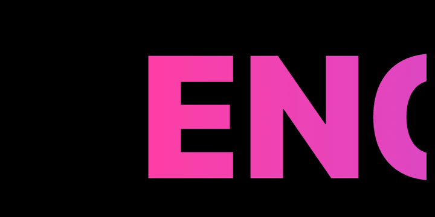
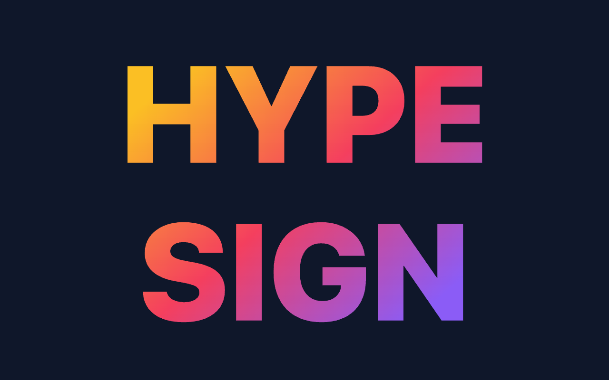
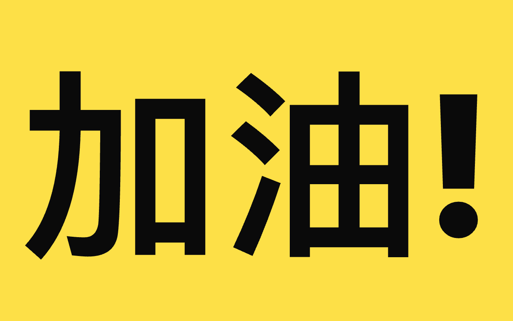
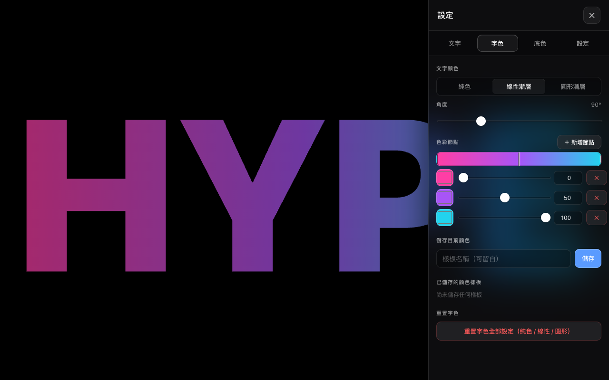
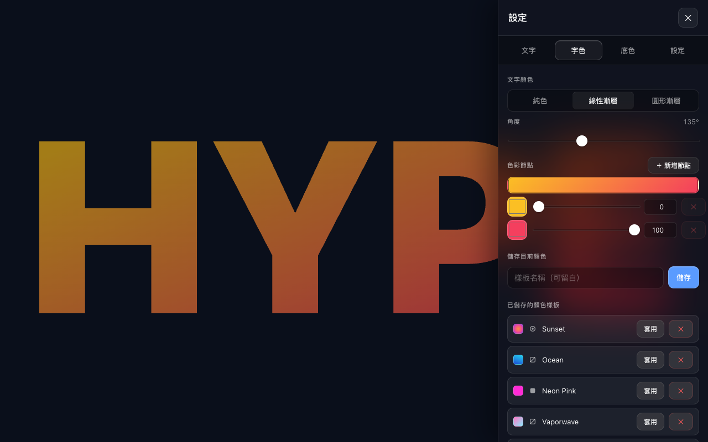
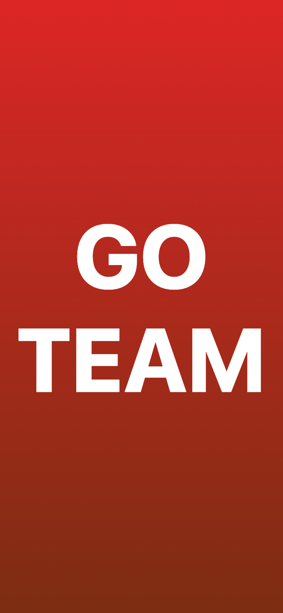
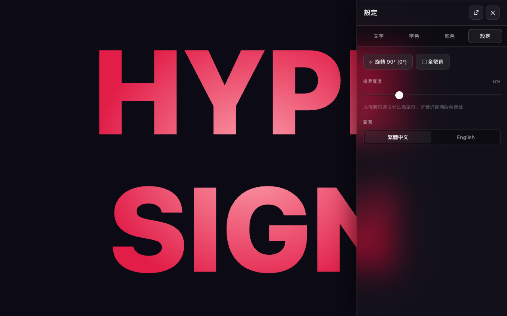
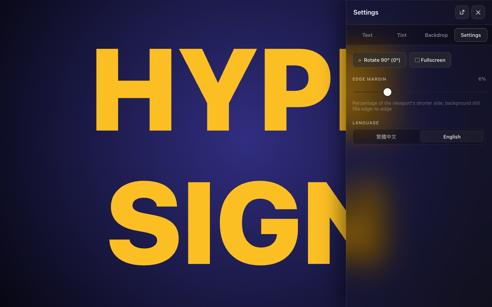

# Hype Sign

電子應援手板 / LED 顯示板 PWA — fully offline, multi-color gradients, marquee mode, Liquid-Glass UI.

> 在演唱會、體育場、戶外活動等任何訊號不穩的場合，把手機 / iPad / PC 變成一塊高亮顯示板。



## Features

- **Static mode** — multi-line text auto-fits to fill the entire screen, gradients span the full block
- **Marquee mode** — joins all lines into one and scrolls horizontally at a constant 100–2000 px/s
- **Color** — solid, linear gradient, or radial gradient for both text and background, with unlimited dynamic color stops
- **Color presets** — save and recall favorite color combos
- **Text presets** — save text-only snippets independently of styling
- **Rotate 90°** in-app, no need to rotate your device
- **Fullscreen** + **Wake Lock** — screen stays on while you cheer
- **Bilingual** — 繁體中文 / English
- **Touch + mouse + pen** via Pointer Events
- **Fully offline** — installs as a PWA, works without network after first load
- **Liquid-Glass UI** — translucent backdrop-blurred settings panel
- **Tap canvas to toggle settings** — single tap on the design surface opens or closes the settings panel; no separate gear button needed, the canvas itself is the trigger
- **Split / floating panel modes** — desktop docks the settings panel on the right, or pop it out as a draggable, resizable floating window (drag header to move, drag bottom handle to resize); mode preference persisted
- **Resizable bottom sheet on mobile** — drag the top handle to grow the panel up to ~90% of the screen, leaving ~10vh of canvas tappable above so you can dismiss the panel by tapping it
- **Edge margin slider** — set how much breathing room sits between the text and the screen edges (0–25% of the viewport's short side); background fills edge-to-edge regardless
- **iOS-safe layout** — text content automatically dodges the iPhone notch and home-indicator via `env(safe-area-inset-*)`, while the background still extends to the physical edges; rotation (0°/90°/180°/270°) fits the safe canvas exactly, no clipping at the notch or screen edges
- **Font weight slider** — pick a weight from 100 (thin) to 900 (black) in steps of 100; falls back to the nearest weight the active system font ships

## Screenshots

| Static auto-fit gradient | Cheering board |
|---|---|
|  |  |

| Gradient editor | Color preset library |
|---|---|
|  |  |

| Mobile portrait | Bilingual UI (繁體中文 / English) |
|---|---|
|  |   |

Captured by `scripts/capture-screenshots.cjs` (Puppeteer + ffmpeg). Run with:

```bash
nvm use 18
NODE_PATH=$(npm root -g) node scripts/capture-screenshots.cjs
# Or recapture a single scene:
NODE_PATH=$(npm root -g) node scripts/capture-screenshots.cjs --only=hero
```

## Quick start

```bash
npm install
npm run dev        # dev server on http://localhost:5173
npm run build      # production build into dist/
npm run preview    # serve the production build locally
npm run typecheck  # tsc --noEmit
npm run smoke      # headless puppeteer smoke suite (Node 18 + global puppeteer)
```

Requires Node 20 or newer for dev/build (the `smoke` script needs Node 18 for Puppeteer; switch via `nvm use 18`).

The smoke suite covers layout integrity, rotation-centering (measures actual glyph ink), panel modes, drag clamps, persistence + migrations, i18n parity, and visual snapshots. Headless Puppeteer reproduces layout but **not** iOS-specific quirks — real-device validation is still required for iOS PWA changes. Filter with `npm run smoke -- --only=panel`.

## Settings panel

The drawer is split into four tabs to keep things scannable:

| Tab | Contents |
|---|---|
| Text | text input · static/marquee mode · marquee speed · font weight · text presets · clear text |
| Tint | text-color editor · save current color · shared color presets (apply to text) · reset tint |
| Backdrop | background-color editor · save current color · shared color presets (apply to bg) · reset backdrop |
| Settings | rotate 90° · fullscreen · edge margin · language |

There is no gear button — **tap anywhere on the design canvas** to open or close the panel. The panel itself sits on top of the canvas (no shrinking) so what you see while editing is what shows when you dismiss it.

Two layout modes (toggle in the panel header, desktop only):

- **Split** (default) — panel docks to the right (desktop) or bottom (mobile). The mobile bottom sheet has a top resize handle so you can grow the panel up to ~90vh and shrink it back when the canvas needs more room.
- **Floating** — panel becomes a draggable free window. Drag the header to reposition; drag the bottom handle to resize. Position and height are persisted, and the panel re-clamps onto the visible viewport when the window resizes.

Color presets are single-color snapshots: a preset stores **one** ColorValue (solid / linear / radial) and you decide at apply-time whether it goes onto the text or the background. Both color tabs share the same preset list. Each preset row shows a tiny type icon next to the swatch (with hover/tap tooltip) so you can tell solid / linear / radial apart even when a multi-stop gradient renders too small.

Reset is per-color: resetting tint clears the text color across all three types (solid + linear + radial) but leaves backdrop alone, and vice versa. Destructive actions (reset, preset delete, text clear) confirm by tapping twice — no popup dialog. Applying a saved preset also asks for a second tap before overwriting your current color.

Saved snapshots are called 「樣板」 (templates) in the Chinese UI, not 「預設」, since the latter is the standard zh-TW word for "default" and would be confusing.

## Deploy

The repo auto-deploys to GitHub Pages on every push to `main` via `.github/workflows/deploy.yml`.

After forking to a new GitHub repo:

1. Settings → Pages → **Source: GitHub Actions**
2. Push to `main` — the workflow runs typecheck, build, and publish
3. Open `https://<username>.github.io/<repo-name>/`

The Vite `base` is `/hype-sign/`. If you fork under a different repo name, update `base` in `vite.config.ts` and `start_url` / `scope` in the manifest there.

## Icons

A vintage CRT look — black tile, almost-invisible horizontal scan lines, radial vignette with warm amber corners, and three high-saturation bars (green / red / yellow) wrapped in an LED phosphor bloom. Three SVG sources for three surfaces:

- `public/favicon.svg` — rounded-square version with a 2px transparent margin (browser tab favicon).
- `public/icon-pwa.svg` — full-bleed version (used for the 192/512 PWA PNGs so iOS/Android can add their own corner masks).
- `public/icon-maskable.svg` — full-bleed too, with bars inset to fit the maskable ~80% safe zone.

All PNGs are rasterized with [librsvg](https://wiki.gnome.org/Projects/LibRsvg)'s `rsvg-convert`. To re-render after editing the SVGs:

```bash
brew install librsvg    # one-time, if not already installed
rsvg-convert -w 192 -h 192 public/icon-pwa.svg       -o public/icons/192.png
rsvg-convert -w 512 -h 512 public/icon-pwa.svg       -o public/icons/512.png
rsvg-convert -w 512 -h 512 public/icon-maskable.svg  -o public/icons/maskable-512.png
```

## Architecture

See [SPEC.md](SPEC.md) for the full architecture spec — modules, data model, render pipeline, store actions, PWA setup, and gotchas.

## Tech stack

- Vite 6 + React 18 + TypeScript
- zustand 5 (with `persist` middleware → localStorage)
- vite-plugin-pwa (Workbox precache, auto-update SW)
- No UI library — every component is hand-rolled for full touch/styling control

## Why a service worker if there's no network feature?

Even without API calls, the app's own files (HTML / JS / CSS / icons) need a server to deliver them on every visit. The service worker pre-caches the app shell so the page loads instantly with **zero network**, which is the whole point in venues with bad reception. See `vite.config.ts` for the workbox config.

## License

MIT
