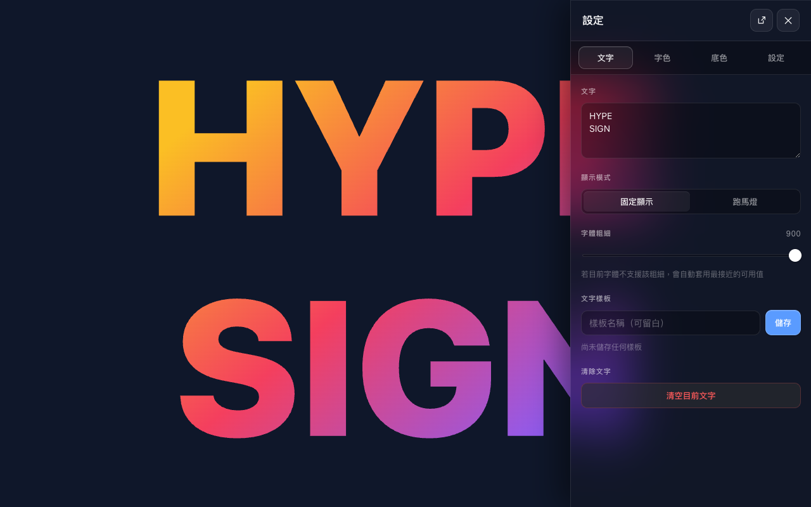
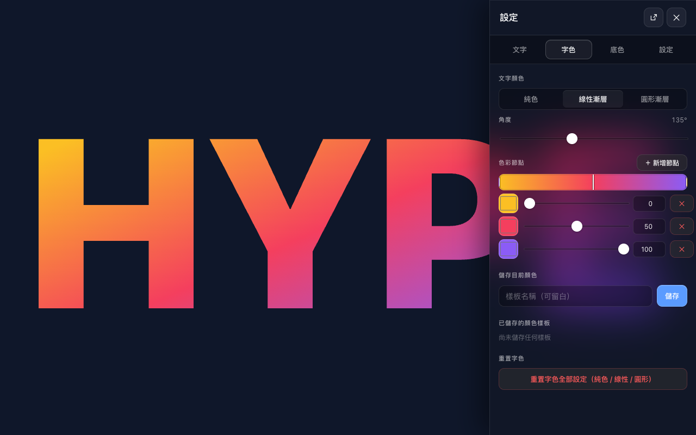
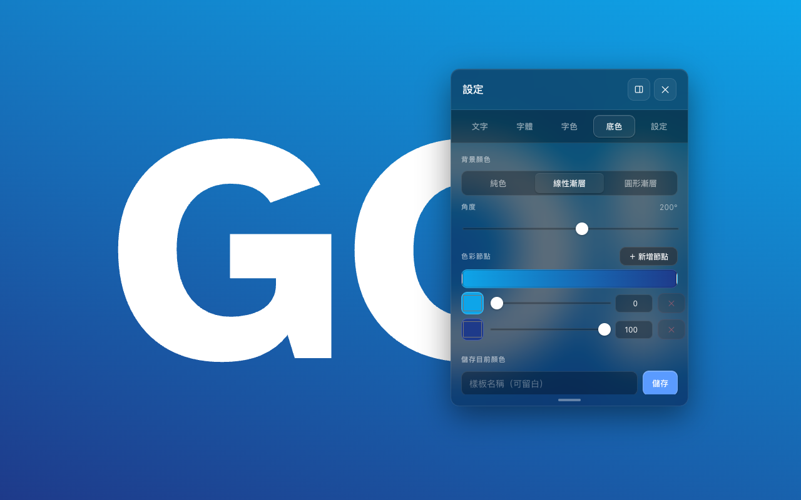
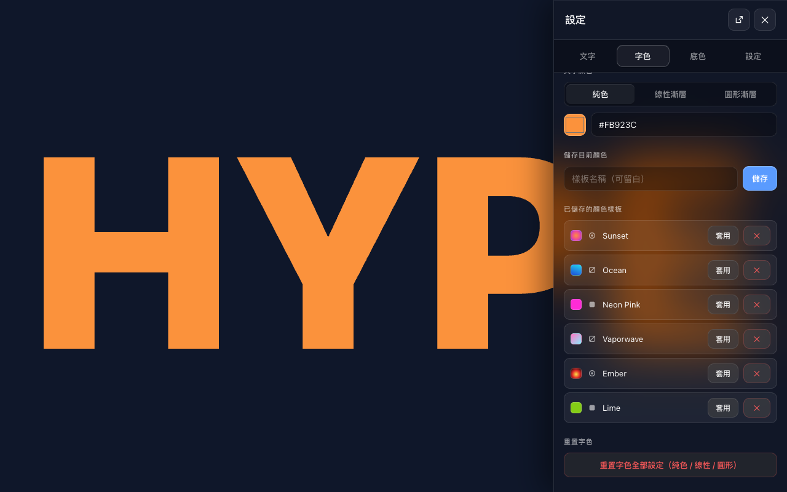
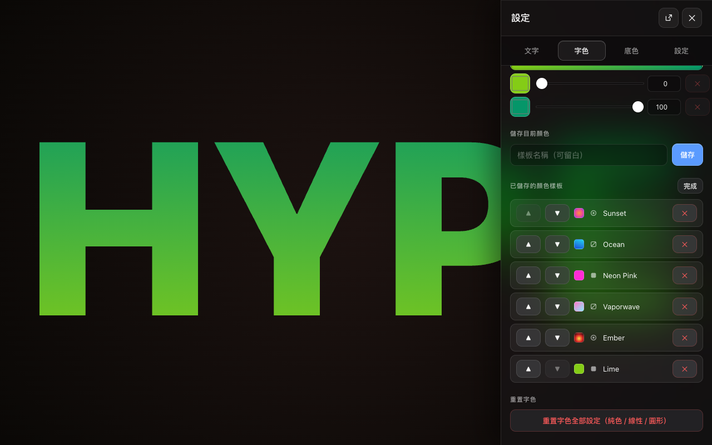
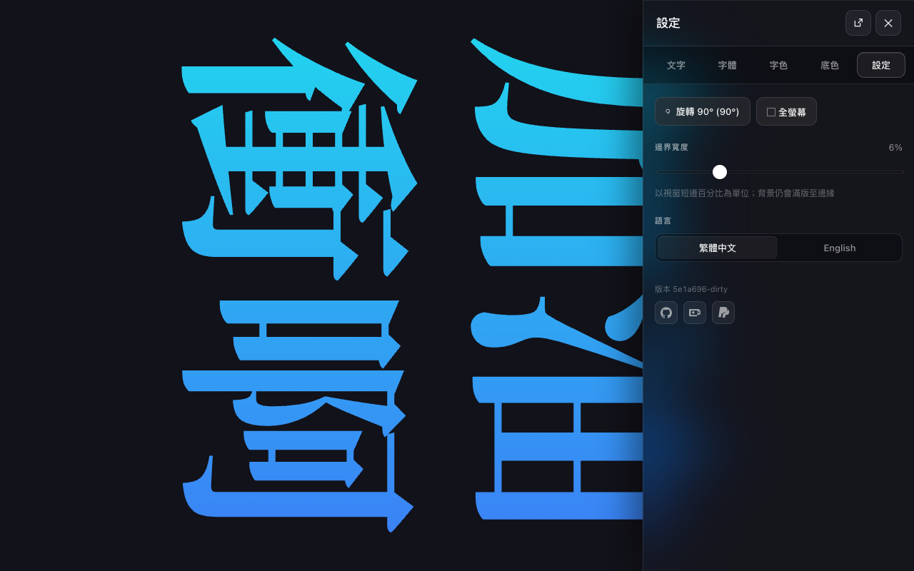
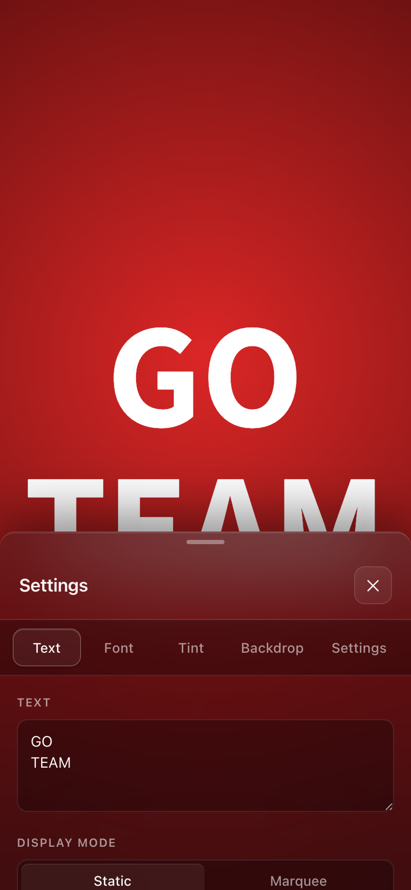
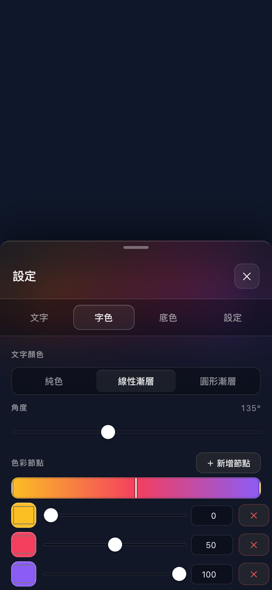

# Hype Sign

A fully-offline cheering board / LED display PWA. Multi-color gradients, marquee mode, Liquid-Glass UI.

**Live: [lab.howar31.com/hype-sign/](https://lab.howar31.com/hype-sign/)**

## Features

- **Static mode** — multi-line text auto-fits to fill the viewport.
- **Marquee mode** — single-line horizontal scroll at 100–2000 px/s. Multi-line text is merged into a single line automatically.
- **Color** — solid, linear gradient, or radial gradient on text and background, with unlimited color stops.
- **Color presets** — save single-color snapshots and apply them to either text or background. Edit mode for reorder and delete.
- **Text presets** — save text-only snippets independently of styling. Edit mode for reorder and delete.
- **Rotation** — 0° / 90° / 180° / 270°, in-app.
- **Fullscreen + Wake Lock** — keeps the screen on while foregrounded.
- **Bilingual UI** — Traditional Chinese (zh-TW) and English.
- **Touch + mouse + pen** input via Pointer Events.
- **Fully offline** — installs as a PWA; runs without network after the first load.
- **Liquid-Glass settings panel** — translucent backdrop-blurred drawer.
- **Tap canvas to toggle settings** — a tap on the design surface opens or closes the panel.
- **Split / floating panel modes (desktop)** — dock the panel right, or pop it out as a draggable, resizable floating window. Drag the header to move; drag the bottom handle to resize. Mode preference persists.
- **Resizable mobile bottom sheet** — drag the top handle to size the panel from 200 px up to 90% of the viewport.
- **Edge margin slider** — 0–25% of the viewport's short side; background fills edge-to-edge regardless.
- **iOS-safe layout** — text respects the iPhone notch and home indicator; background extends to the physical edges; rotation fits the safe canvas exactly.
- **Font weight slider** — 100 to 900 in steps of 100.
- **System font** — uses the platform's default system typeface for maximum compatibility across devices.
- **Build-version footer** — the Settings tab shows the deployed commit and quietly notes when a new version has been downloaded in the background. Brand-tinted icon links to the GitHub repo, Ko-fi, and PayPal.

## Screenshots

### Desktop

| Text tab — multi-line + font weight | Tint tab — gradient editor | Floating panel — backdrop |
|---|---|---|
|  |  |  |

| Color preset library | Edit mode — reorder + delete | Rotation + Settings tab |
|---|---|---|
|  |  |  |

### Mobile

| Bottom sheet — Text tab (top resize handle) | Bottom sheet — gradient editor |
|---|---|
|  |  |

### Bilingual

| Traditional Chinese (zh-TW) | English (en) |
|---|---|
|  |  |

## Settings panel

The drawer has four tabs:

| Tab | Contents |
|---|---|
| Text | text input · static / marquee mode · marquee speed · font weight · text presets · clear text |
| Tint | text-color editor · save current color · shared color presets (apply to text, edit mode for reorder + delete) · reset tint |
| Backdrop | background-color editor · save current color · shared color presets (apply to background, edit mode for reorder + delete) · reset backdrop |
| Settings | rotate · fullscreen · edge margin · language · build version (with quiet new-version hint) · GitHub / Ko-fi / PayPal icon links |

A tap on the design canvas opens or closes the panel. The panel overlays the canvas; closing it reveals the unobstructed design.

Two layout modes (desktop only, toggle in the panel header):

- **Split** (default) — panel docks to the right on desktop, to the bottom on mobile. The mobile bottom sheet has a top resize handle.
- **Floating** — panel becomes a draggable window with a bottom resize handle. Position and height persist.

Color presets store one `ColorValue` (solid / linear / radial); the apply step routes it to either the text or the background. Both color tabs share the same preset list. An Edit mode toggle reveals reorder (move up / move down) and delete controls while hiding Apply, keeping the default view clean.

Resetting tint clears the text color across all three types (solid, linear, radial) and leaves the background untouched; resetting backdrop is the inverse.

Destructive actions (reset, preset delete, text clear) and preset application require a second tap to confirm.

## Development

For local-development setup, deploy pipeline, icon regeneration, and the full architecture spec, see [SPEC.md](SPEC.md).

## License

[MIT](LICENSE)
